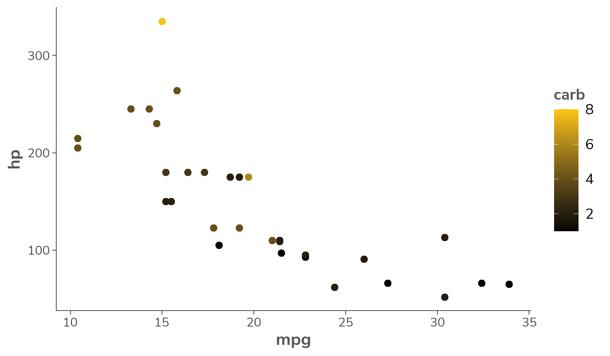
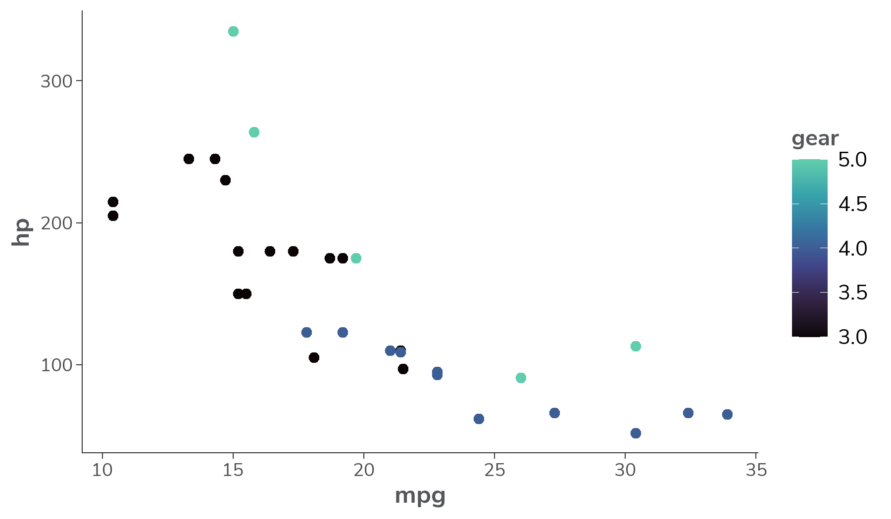
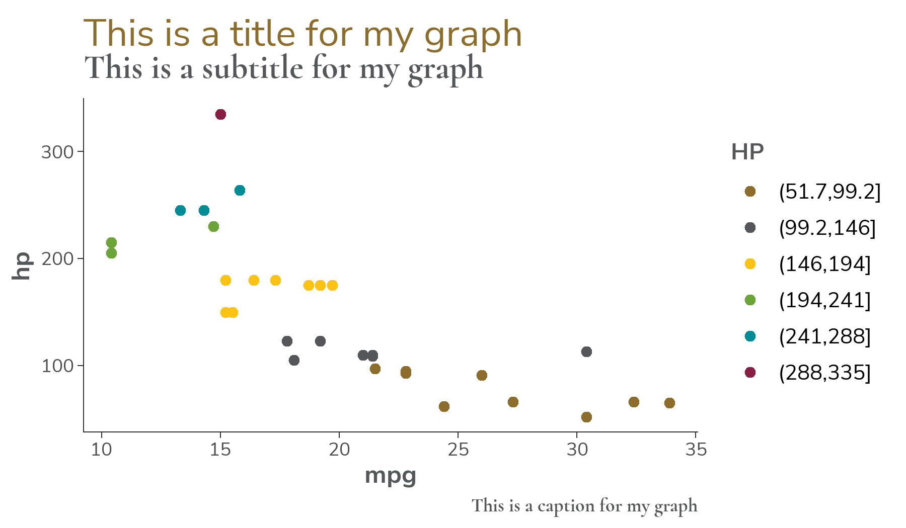
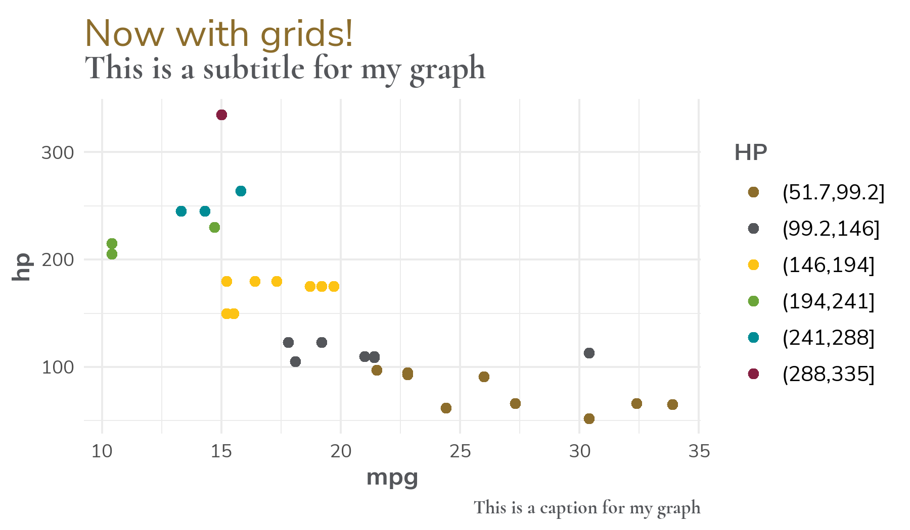
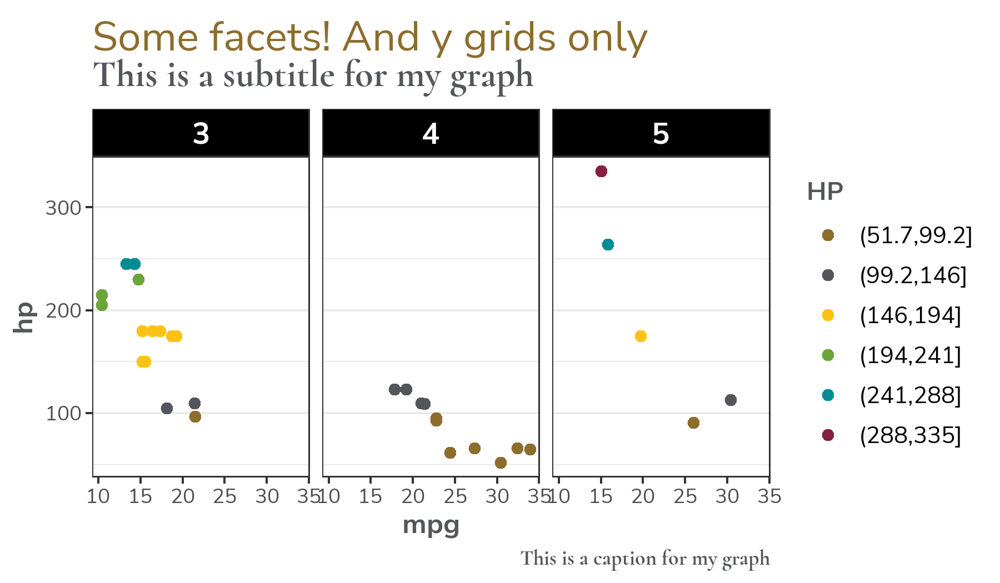
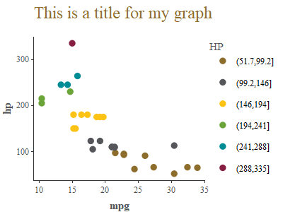
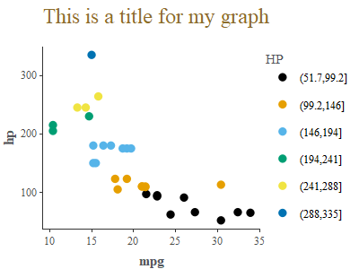
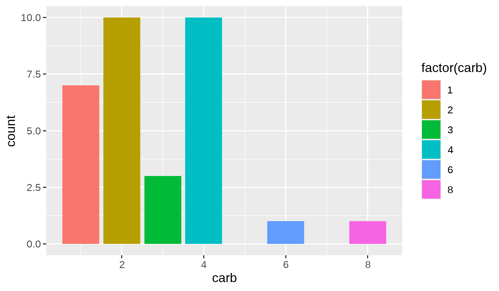
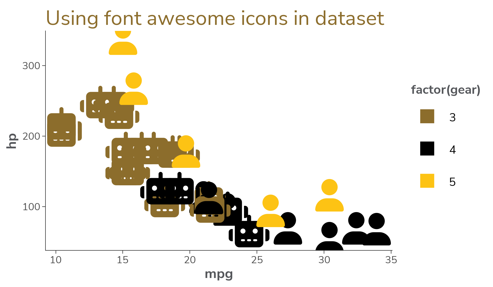

<!-- README.md is generated from README.Rmd. Please edit that file -->

# idstyle

<!-- badges: start -->

[](https://github.com/wf-id/idstyle/actions)
<!-- badges: end -->

The goal of idstyle is to …

## Installation

You can install the development version of idstyle like so:

``` r
remotes::install_github("wf-id/idstyle")
```

## Examples

### Tables

Flextable formatting:

- Black & white (default)

``` r
suppressPackageStartupMessages(library(tidyverse))
suppressPackageStartupMessages(library(idstyle))
head(mtcars) |> format_flex_table() 
```

<div class="tabwid"><style>.cl-cd5af254{}.cl-cd489000{font-family:'Arial';font-size:11pt;font-weight:normal;font-style:normal;text-decoration:none;color:rgba(0, 0, 0, 1.00);background-color:transparent;}.cl-cd489064{font-family:'Arial';font-size:10pt;font-weight:normal;font-style:normal;text-decoration:none;color:rgba(0, 0, 0, 1.00);background-color:transparent;}.cl-cd4f51f6{margin:0;text-align:right;border-bottom: 0 solid rgba(0, 0, 0, 1.00);border-top: 0 solid rgba(0, 0, 0, 1.00);border-left: 0 solid rgba(0, 0, 0, 1.00);border-right: 0 solid rgba(0, 0, 0, 1.00);padding-bottom:5pt;padding-top:5pt;padding-left:5pt;padding-right:5pt;line-height: 1;background-color:transparent;}.cl-cd4f755a{width:0.509in;background-color:transparent;vertical-align: middle;border-bottom: 1.5pt solid rgba(102, 102, 102, 1.00);border-top: 1.5pt solid rgba(102, 102, 102, 1.00);border-left: 0 solid rgba(0, 0, 0, 1.00);border-right: 0 solid rgba(0, 0, 0, 1.00);margin-bottom:0;margin-top:0;margin-left:0;margin-right:0;}.cl-cd4f7564{width:0.509in;background-color:transparent;vertical-align: middle;border-bottom: 0 solid rgba(0, 0, 0, 1.00);border-top: 0 solid rgba(0, 0, 0, 1.00);border-left: 0 solid rgba(0, 0, 0, 1.00);border-right: 0 solid rgba(0, 0, 0, 1.00);margin-bottom:0;margin-top:0;margin-left:0;margin-right:0;}.cl-cd4f756e{width:0.509in;background-color:transparent;vertical-align: middle;border-bottom: 1.5pt solid rgba(102, 102, 102, 1.00);border-top: 0 solid rgba(0, 0, 0, 1.00);border-left: 0 solid rgba(0, 0, 0, 1.00);border-right: 0 solid rgba(0, 0, 0, 1.00);margin-bottom:0;margin-top:0;margin-left:0;margin-right:0;}</style><table data-quarto-disable-processing='true' class='cl-cd5af254'><thead><tr style="overflow-wrap:break-word;"><th class="cl-cd4f755a"><p class="cl-cd4f51f6"><span class="cl-cd489000">mpg</span></p></th><th class="cl-cd4f755a"><p class="cl-cd4f51f6"><span class="cl-cd489000">cyl</span></p></th><th class="cl-cd4f755a"><p class="cl-cd4f51f6"><span class="cl-cd489000">disp</span></p></th><th class="cl-cd4f755a"><p class="cl-cd4f51f6"><span class="cl-cd489000">hp</span></p></th><th class="cl-cd4f755a"><p class="cl-cd4f51f6"><span class="cl-cd489000">drat</span></p></th><th class="cl-cd4f755a"><p class="cl-cd4f51f6"><span class="cl-cd489000">wt</span></p></th><th class="cl-cd4f755a"><p class="cl-cd4f51f6"><span class="cl-cd489000">qsec</span></p></th><th class="cl-cd4f755a"><p class="cl-cd4f51f6"><span class="cl-cd489000">vs</span></p></th><th class="cl-cd4f755a"><p class="cl-cd4f51f6"><span class="cl-cd489000">am</span></p></th><th class="cl-cd4f755a"><p class="cl-cd4f51f6"><span class="cl-cd489000">gear</span></p></th><th class="cl-cd4f755a"><p class="cl-cd4f51f6"><span class="cl-cd489000">carb</span></p></th></tr></thead><tbody><tr style="overflow-wrap:break-word;"><td class="cl-cd4f7564"><p class="cl-cd4f51f6"><span class="cl-cd489064">21.0</span></p></td><td class="cl-cd4f7564"><p class="cl-cd4f51f6"><span class="cl-cd489064">6</span></p></td><td class="cl-cd4f7564"><p class="cl-cd4f51f6"><span class="cl-cd489064">160</span></p></td><td class="cl-cd4f7564"><p class="cl-cd4f51f6"><span class="cl-cd489064">110</span></p></td><td class="cl-cd4f7564"><p class="cl-cd4f51f6"><span class="cl-cd489064">3.9</span></p></td><td class="cl-cd4f7564"><p class="cl-cd4f51f6"><span class="cl-cd489064">2.6</span></p></td><td class="cl-cd4f7564"><p class="cl-cd4f51f6"><span class="cl-cd489064">16.5</span></p></td><td class="cl-cd4f7564"><p class="cl-cd4f51f6"><span class="cl-cd489064">0</span></p></td><td class="cl-cd4f7564"><p class="cl-cd4f51f6"><span class="cl-cd489064">1</span></p></td><td class="cl-cd4f7564"><p class="cl-cd4f51f6"><span class="cl-cd489064">4</span></p></td><td class="cl-cd4f7564"><p class="cl-cd4f51f6"><span class="cl-cd489064">4</span></p></td></tr><tr style="overflow-wrap:break-word;"><td class="cl-cd4f7564"><p class="cl-cd4f51f6"><span class="cl-cd489064">21.0</span></p></td><td class="cl-cd4f7564"><p class="cl-cd4f51f6"><span class="cl-cd489064">6</span></p></td><td class="cl-cd4f7564"><p class="cl-cd4f51f6"><span class="cl-cd489064">160</span></p></td><td class="cl-cd4f7564"><p class="cl-cd4f51f6"><span class="cl-cd489064">110</span></p></td><td class="cl-cd4f7564"><p class="cl-cd4f51f6"><span class="cl-cd489064">3.9</span></p></td><td class="cl-cd4f7564"><p class="cl-cd4f51f6"><span class="cl-cd489064">2.9</span></p></td><td class="cl-cd4f7564"><p class="cl-cd4f51f6"><span class="cl-cd489064">17.0</span></p></td><td class="cl-cd4f7564"><p class="cl-cd4f51f6"><span class="cl-cd489064">0</span></p></td><td class="cl-cd4f7564"><p class="cl-cd4f51f6"><span class="cl-cd489064">1</span></p></td><td class="cl-cd4f7564"><p class="cl-cd4f51f6"><span class="cl-cd489064">4</span></p></td><td class="cl-cd4f7564"><p class="cl-cd4f51f6"><span class="cl-cd489064">4</span></p></td></tr><tr style="overflow-wrap:break-word;"><td class="cl-cd4f7564"><p class="cl-cd4f51f6"><span class="cl-cd489064">22.8</span></p></td><td class="cl-cd4f7564"><p class="cl-cd4f51f6"><span class="cl-cd489064">4</span></p></td><td class="cl-cd4f7564"><p class="cl-cd4f51f6"><span class="cl-cd489064">108</span></p></td><td class="cl-cd4f7564"><p class="cl-cd4f51f6"><span class="cl-cd489064">93</span></p></td><td class="cl-cd4f7564"><p class="cl-cd4f51f6"><span class="cl-cd489064">3.8</span></p></td><td class="cl-cd4f7564"><p class="cl-cd4f51f6"><span class="cl-cd489064">2.3</span></p></td><td class="cl-cd4f7564"><p class="cl-cd4f51f6"><span class="cl-cd489064">18.6</span></p></td><td class="cl-cd4f7564"><p class="cl-cd4f51f6"><span class="cl-cd489064">1</span></p></td><td class="cl-cd4f7564"><p class="cl-cd4f51f6"><span class="cl-cd489064">1</span></p></td><td class="cl-cd4f7564"><p class="cl-cd4f51f6"><span class="cl-cd489064">4</span></p></td><td class="cl-cd4f7564"><p class="cl-cd4f51f6"><span class="cl-cd489064">1</span></p></td></tr><tr style="overflow-wrap:break-word;"><td class="cl-cd4f7564"><p class="cl-cd4f51f6"><span class="cl-cd489064">21.4</span></p></td><td class="cl-cd4f7564"><p class="cl-cd4f51f6"><span class="cl-cd489064">6</span></p></td><td class="cl-cd4f7564"><p class="cl-cd4f51f6"><span class="cl-cd489064">258</span></p></td><td class="cl-cd4f7564"><p class="cl-cd4f51f6"><span class="cl-cd489064">110</span></p></td><td class="cl-cd4f7564"><p class="cl-cd4f51f6"><span class="cl-cd489064">3.1</span></p></td><td class="cl-cd4f7564"><p class="cl-cd4f51f6"><span class="cl-cd489064">3.2</span></p></td><td class="cl-cd4f7564"><p class="cl-cd4f51f6"><span class="cl-cd489064">19.4</span></p></td><td class="cl-cd4f7564"><p class="cl-cd4f51f6"><span class="cl-cd489064">1</span></p></td><td class="cl-cd4f7564"><p class="cl-cd4f51f6"><span class="cl-cd489064">0</span></p></td><td class="cl-cd4f7564"><p class="cl-cd4f51f6"><span class="cl-cd489064">3</span></p></td><td class="cl-cd4f7564"><p class="cl-cd4f51f6"><span class="cl-cd489064">1</span></p></td></tr><tr style="overflow-wrap:break-word;"><td class="cl-cd4f7564"><p class="cl-cd4f51f6"><span class="cl-cd489064">18.7</span></p></td><td class="cl-cd4f7564"><p class="cl-cd4f51f6"><span class="cl-cd489064">8</span></p></td><td class="cl-cd4f7564"><p class="cl-cd4f51f6"><span class="cl-cd489064">360</span></p></td><td class="cl-cd4f7564"><p class="cl-cd4f51f6"><span class="cl-cd489064">175</span></p></td><td class="cl-cd4f7564"><p class="cl-cd4f51f6"><span class="cl-cd489064">3.1</span></p></td><td class="cl-cd4f7564"><p class="cl-cd4f51f6"><span class="cl-cd489064">3.4</span></p></td><td class="cl-cd4f7564"><p class="cl-cd4f51f6"><span class="cl-cd489064">17.0</span></p></td><td class="cl-cd4f7564"><p class="cl-cd4f51f6"><span class="cl-cd489064">0</span></p></td><td class="cl-cd4f7564"><p class="cl-cd4f51f6"><span class="cl-cd489064">0</span></p></td><td class="cl-cd4f7564"><p class="cl-cd4f51f6"><span class="cl-cd489064">3</span></p></td><td class="cl-cd4f7564"><p class="cl-cd4f51f6"><span class="cl-cd489064">2</span></p></td></tr><tr style="overflow-wrap:break-word;"><td class="cl-cd4f756e"><p class="cl-cd4f51f6"><span class="cl-cd489064">18.1</span></p></td><td class="cl-cd4f756e"><p class="cl-cd4f51f6"><span class="cl-cd489064">6</span></p></td><td class="cl-cd4f756e"><p class="cl-cd4f51f6"><span class="cl-cd489064">225</span></p></td><td class="cl-cd4f756e"><p class="cl-cd4f51f6"><span class="cl-cd489064">105</span></p></td><td class="cl-cd4f756e"><p class="cl-cd4f51f6"><span class="cl-cd489064">2.8</span></p></td><td class="cl-cd4f756e"><p class="cl-cd4f51f6"><span class="cl-cd489064">3.5</span></p></td><td class="cl-cd4f756e"><p class="cl-cd4f51f6"><span class="cl-cd489064">20.2</span></p></td><td class="cl-cd4f756e"><p class="cl-cd4f51f6"><span class="cl-cd489064">1</span></p></td><td class="cl-cd4f756e"><p class="cl-cd4f51f6"><span class="cl-cd489064">0</span></p></td><td class="cl-cd4f756e"><p class="cl-cd4f51f6"><span class="cl-cd489064">3</span></p></td><td class="cl-cd4f756e"><p class="cl-cd4f51f6"><span class="cl-cd489064">1</span></p></td></tr></tbody></table></div>

- “wake” color

``` r
head(mtcars) |> format_flex_table(color = 'wake') 
```

<div class="tabwid"><style>.cl-cde66e24{}.cl-cdd02c5e{font-family:'Arial';font-size:11pt;font-weight:bold;font-style:normal;text-decoration:none;color:rgba(255, 255, 255, 1.00);background-color:transparent;}.cl-cdd02c72{font-family:'Arial';font-size:10pt;font-weight:normal;font-style:normal;text-decoration:none;color:rgba(0, 0, 0, 1.00);background-color:transparent;}.cl-cdd758ee{margin:0;text-align:right;border-bottom: 0 solid rgba(0, 0, 0, 1.00);border-top: 0 solid rgba(0, 0, 0, 1.00);border-left: 0 solid rgba(0, 0, 0, 1.00);border-right: 0 solid rgba(0, 0, 0, 1.00);padding-bottom:5pt;padding-top:5pt;padding-left:5pt;padding-right:5pt;line-height: 1;background-color:transparent;}.cl-cdd78530{width:0.509in;background-color:rgba(140, 109, 44, 1.00);vertical-align: middle;border-bottom: 0 solid rgba(0, 0, 0, 1.00);border-top: 0 solid rgba(0, 0, 0, 1.00);border-left: 0 solid rgba(0, 0, 0, 1.00);border-right: 0 solid rgba(0, 0, 0, 1.00);margin-bottom:0;margin-top:0;margin-left:0;margin-right:0;}.cl-cdd78544{width:0.509in;background-color:rgba(239, 239, 239, 1.00);vertical-align: middle;border-bottom: 0 solid rgba(0, 0, 0, 1.00);border-top: 0 solid rgba(0, 0, 0, 1.00);border-left: 0 solid rgba(0, 0, 0, 1.00);border-right: 0 solid rgba(0, 0, 0, 1.00);margin-bottom:0;margin-top:0;margin-left:0;margin-right:0;}.cl-cdd78545{width:0.509in;background-color:transparent;vertical-align: middle;border-bottom: 0 solid rgba(0, 0, 0, 1.00);border-top: 0 solid rgba(0, 0, 0, 1.00);border-left: 0 solid rgba(0, 0, 0, 1.00);border-right: 0 solid rgba(0, 0, 0, 1.00);margin-bottom:0;margin-top:0;margin-left:0;margin-right:0;}</style><table data-quarto-disable-processing='true' class='cl-cde66e24'><thead><tr style="overflow-wrap:break-word;"><th class="cl-cdd78530"><p class="cl-cdd758ee"><span class="cl-cdd02c5e">mpg</span></p></th><th class="cl-cdd78530"><p class="cl-cdd758ee"><span class="cl-cdd02c5e">cyl</span></p></th><th class="cl-cdd78530"><p class="cl-cdd758ee"><span class="cl-cdd02c5e">disp</span></p></th><th class="cl-cdd78530"><p class="cl-cdd758ee"><span class="cl-cdd02c5e">hp</span></p></th><th class="cl-cdd78530"><p class="cl-cdd758ee"><span class="cl-cdd02c5e">drat</span></p></th><th class="cl-cdd78530"><p class="cl-cdd758ee"><span class="cl-cdd02c5e">wt</span></p></th><th class="cl-cdd78530"><p class="cl-cdd758ee"><span class="cl-cdd02c5e">qsec</span></p></th><th class="cl-cdd78530"><p class="cl-cdd758ee"><span class="cl-cdd02c5e">vs</span></p></th><th class="cl-cdd78530"><p class="cl-cdd758ee"><span class="cl-cdd02c5e">am</span></p></th><th class="cl-cdd78530"><p class="cl-cdd758ee"><span class="cl-cdd02c5e">gear</span></p></th><th class="cl-cdd78530"><p class="cl-cdd758ee"><span class="cl-cdd02c5e">carb</span></p></th></tr></thead><tbody><tr style="overflow-wrap:break-word;"><td class="cl-cdd78544"><p class="cl-cdd758ee"><span class="cl-cdd02c72">21.0</span></p></td><td class="cl-cdd78544"><p class="cl-cdd758ee"><span class="cl-cdd02c72">6</span></p></td><td class="cl-cdd78544"><p class="cl-cdd758ee"><span class="cl-cdd02c72">160</span></p></td><td class="cl-cdd78544"><p class="cl-cdd758ee"><span class="cl-cdd02c72">110</span></p></td><td class="cl-cdd78544"><p class="cl-cdd758ee"><span class="cl-cdd02c72">3.9</span></p></td><td class="cl-cdd78544"><p class="cl-cdd758ee"><span class="cl-cdd02c72">2.6</span></p></td><td class="cl-cdd78544"><p class="cl-cdd758ee"><span class="cl-cdd02c72">16.5</span></p></td><td class="cl-cdd78544"><p class="cl-cdd758ee"><span class="cl-cdd02c72">0</span></p></td><td class="cl-cdd78544"><p class="cl-cdd758ee"><span class="cl-cdd02c72">1</span></p></td><td class="cl-cdd78544"><p class="cl-cdd758ee"><span class="cl-cdd02c72">4</span></p></td><td class="cl-cdd78544"><p class="cl-cdd758ee"><span class="cl-cdd02c72">4</span></p></td></tr><tr style="overflow-wrap:break-word;"><td class="cl-cdd78545"><p class="cl-cdd758ee"><span class="cl-cdd02c72">21.0</span></p></td><td class="cl-cdd78545"><p class="cl-cdd758ee"><span class="cl-cdd02c72">6</span></p></td><td class="cl-cdd78545"><p class="cl-cdd758ee"><span class="cl-cdd02c72">160</span></p></td><td class="cl-cdd78545"><p class="cl-cdd758ee"><span class="cl-cdd02c72">110</span></p></td><td class="cl-cdd78545"><p class="cl-cdd758ee"><span class="cl-cdd02c72">3.9</span></p></td><td class="cl-cdd78545"><p class="cl-cdd758ee"><span class="cl-cdd02c72">2.9</span></p></td><td class="cl-cdd78545"><p class="cl-cdd758ee"><span class="cl-cdd02c72">17.0</span></p></td><td class="cl-cdd78545"><p class="cl-cdd758ee"><span class="cl-cdd02c72">0</span></p></td><td class="cl-cdd78545"><p class="cl-cdd758ee"><span class="cl-cdd02c72">1</span></p></td><td class="cl-cdd78545"><p class="cl-cdd758ee"><span class="cl-cdd02c72">4</span></p></td><td class="cl-cdd78545"><p class="cl-cdd758ee"><span class="cl-cdd02c72">4</span></p></td></tr><tr style="overflow-wrap:break-word;"><td class="cl-cdd78544"><p class="cl-cdd758ee"><span class="cl-cdd02c72">22.8</span></p></td><td class="cl-cdd78544"><p class="cl-cdd758ee"><span class="cl-cdd02c72">4</span></p></td><td class="cl-cdd78544"><p class="cl-cdd758ee"><span class="cl-cdd02c72">108</span></p></td><td class="cl-cdd78544"><p class="cl-cdd758ee"><span class="cl-cdd02c72">93</span></p></td><td class="cl-cdd78544"><p class="cl-cdd758ee"><span class="cl-cdd02c72">3.8</span></p></td><td class="cl-cdd78544"><p class="cl-cdd758ee"><span class="cl-cdd02c72">2.3</span></p></td><td class="cl-cdd78544"><p class="cl-cdd758ee"><span class="cl-cdd02c72">18.6</span></p></td><td class="cl-cdd78544"><p class="cl-cdd758ee"><span class="cl-cdd02c72">1</span></p></td><td class="cl-cdd78544"><p class="cl-cdd758ee"><span class="cl-cdd02c72">1</span></p></td><td class="cl-cdd78544"><p class="cl-cdd758ee"><span class="cl-cdd02c72">4</span></p></td><td class="cl-cdd78544"><p class="cl-cdd758ee"><span class="cl-cdd02c72">1</span></p></td></tr><tr style="overflow-wrap:break-word;"><td class="cl-cdd78545"><p class="cl-cdd758ee"><span class="cl-cdd02c72">21.4</span></p></td><td class="cl-cdd78545"><p class="cl-cdd758ee"><span class="cl-cdd02c72">6</span></p></td><td class="cl-cdd78545"><p class="cl-cdd758ee"><span class="cl-cdd02c72">258</span></p></td><td class="cl-cdd78545"><p class="cl-cdd758ee"><span class="cl-cdd02c72">110</span></p></td><td class="cl-cdd78545"><p class="cl-cdd758ee"><span class="cl-cdd02c72">3.1</span></p></td><td class="cl-cdd78545"><p class="cl-cdd758ee"><span class="cl-cdd02c72">3.2</span></p></td><td class="cl-cdd78545"><p class="cl-cdd758ee"><span class="cl-cdd02c72">19.4</span></p></td><td class="cl-cdd78545"><p class="cl-cdd758ee"><span class="cl-cdd02c72">1</span></p></td><td class="cl-cdd78545"><p class="cl-cdd758ee"><span class="cl-cdd02c72">0</span></p></td><td class="cl-cdd78545"><p class="cl-cdd758ee"><span class="cl-cdd02c72">3</span></p></td><td class="cl-cdd78545"><p class="cl-cdd758ee"><span class="cl-cdd02c72">1</span></p></td></tr><tr style="overflow-wrap:break-word;"><td class="cl-cdd78544"><p class="cl-cdd758ee"><span class="cl-cdd02c72">18.7</span></p></td><td class="cl-cdd78544"><p class="cl-cdd758ee"><span class="cl-cdd02c72">8</span></p></td><td class="cl-cdd78544"><p class="cl-cdd758ee"><span class="cl-cdd02c72">360</span></p></td><td class="cl-cdd78544"><p class="cl-cdd758ee"><span class="cl-cdd02c72">175</span></p></td><td class="cl-cdd78544"><p class="cl-cdd758ee"><span class="cl-cdd02c72">3.1</span></p></td><td class="cl-cdd78544"><p class="cl-cdd758ee"><span class="cl-cdd02c72">3.4</span></p></td><td class="cl-cdd78544"><p class="cl-cdd758ee"><span class="cl-cdd02c72">17.0</span></p></td><td class="cl-cdd78544"><p class="cl-cdd758ee"><span class="cl-cdd02c72">0</span></p></td><td class="cl-cdd78544"><p class="cl-cdd758ee"><span class="cl-cdd02c72">0</span></p></td><td class="cl-cdd78544"><p class="cl-cdd758ee"><span class="cl-cdd02c72">3</span></p></td><td class="cl-cdd78544"><p class="cl-cdd758ee"><span class="cl-cdd02c72">2</span></p></td></tr><tr style="overflow-wrap:break-word;"><td class="cl-cdd78545"><p class="cl-cdd758ee"><span class="cl-cdd02c72">18.1</span></p></td><td class="cl-cdd78545"><p class="cl-cdd758ee"><span class="cl-cdd02c72">6</span></p></td><td class="cl-cdd78545"><p class="cl-cdd758ee"><span class="cl-cdd02c72">225</span></p></td><td class="cl-cdd78545"><p class="cl-cdd758ee"><span class="cl-cdd02c72">105</span></p></td><td class="cl-cdd78545"><p class="cl-cdd758ee"><span class="cl-cdd02c72">2.8</span></p></td><td class="cl-cdd78545"><p class="cl-cdd758ee"><span class="cl-cdd02c72">3.5</span></p></td><td class="cl-cdd78545"><p class="cl-cdd758ee"><span class="cl-cdd02c72">20.2</span></p></td><td class="cl-cdd78545"><p class="cl-cdd758ee"><span class="cl-cdd02c72">1</span></p></td><td class="cl-cdd78545"><p class="cl-cdd758ee"><span class="cl-cdd02c72">0</span></p></td><td class="cl-cdd78545"><p class="cl-cdd758ee"><span class="cl-cdd02c72">3</span></p></td><td class="cl-cdd78545"><p class="cl-cdd758ee"><span class="cl-cdd02c72">1</span></p></td></tr></tbody></table></div>

### Plots

- Points with wake gold default

``` r
ggplot(mtcars, aes(x = mpg, y = hp)) +
  geom_point(aes(color = carb))
```



- Wake color palette for factors

``` r
ggplot(mtcars) + geom_bar(aes(x = carb, fill = factor(carb)))
```



- Label formatting

``` r
gg2 <- mtcars |> ggplot(aes(x = mpg, y = hp, color = cut(mtcars$hp,6))) + #discrete scale
  geom_point() + labs(title = 'This is a title for my graph',
                      subtitle = 'This is a subtitle for my graph',
                      caption = 'This is a caption for my graph',
                      color = 'HP')
gg2
```



- Grids

``` r
gg2 + theme_wake(grid = 'both') +
  labs(title = 'Now with grids!')
```



- Facets

``` r
gg2 + facet_wrap(~gear) + theme_wake_facet(grid = 'y') +
  labs(title = 'Some facets! And y grids only')
```



- Interactive

``` r

plotly::ggplotly(gg2)
```



- Theme Updating (ggplot2 default)

``` r

theme_set_gg()
ggplot(mtcars) + geom_bar(aes(x = carb, fill = factor(carb)))
```


- Theme Updating (Atrium default)

``` r

theme_set_atrium()
ggplot(mtcars) + geom_bar(aes(x = carb, fill = factor(carb)))
```



``` r

theme_set_wake() #and back to wake for future graphics
```

- Font Awesome

``` r

mtcars |> ggplot(aes(x = mpg, y = hp)) +
  geom_fontawesome('head-side-virus', size = 10) +
  labs(title = 'Using a font awesome icon')
```



``` r


mtcars |> 
  mutate(myicon = if_else(am==0, 'robot','user')) |>
  ggplot(aes(x = mpg, y = hp, color = factor(gear), fill = factor(gear))) +
  geom_fontawesome(myicon, size = 10) +
  labs(title = 'Using font awesome icons in dataset') +
  guides(color = guide_legend(override.aes = aes(label = "■"))
         ) #otherwise "a" is in legend
```



## Terms of Use

You should not rely on this Website for medical advice or guidance.

The Website relies upon publicly available data that do not always
agree. Authors hereby disclaims any and all representations and
warranties with respect to the Website, including accuracy, fitness for
use, reliability, completeness, and non-infringement of third party
rights.

These terms and conditions are subject to change. Your use of the
Website constitutes your acceptance of these terms and conditions and
any future modifications thereof.
